<div align="center">

# SkuuIll

<picture>
  <source media="(prefers-reduced-motion: reduce)" srcset="./assets/profile-banner-static.svg">
  
</picture>

Desarrollador Full Stack · Argentina

Creo sitios web, aplicaciones y herramientas con foco en una experiencia clara y código mantenible.

<picture>
  <source media="(prefers-reduced-motion: reduce)" srcset="./assets/profile-terminal-static.svg">
  
</picture>

[Contactame por email](mailto:skuuill@gmail.com) · [Explorá mis proyectos](https://github.com/SkuuIll?tab=repositories) · [Landing en preparación](./site/)

**Español** · [English](./translations/README.en.md)

</div>

## 🧑‍💻 Sobre mí

Trabajo con **JavaScript, TypeScript y Python**, desde la interfaz hasta el backend. Mi trabajo también incluye apps móviles, software de escritorio y automatizaciones. Me interesan los productos digitales con identidad propia, la automatización y el desarrollo open source.

- **Frontend:** React, Next.js, HTML y CSS.
- **Backend:** Node.js, Python y Django.
- **Herramientas:** Git, Linux y Docker.
- **Colaboraciones:** desarrollo web, mejoras de productos existentes y proyectos freelance.

## 🚀 Proyectos seleccionados

| Proyecto | Qué vas a encontrar | Enlaces |
| :--- | :--- | :--- |
| **Pipa_arg** | Proyecto web en TypeScript para una identidad del gaming y su comunidad. | [Web](https://skuuill.github.io/Pipa_arg/) · [Código](https://github.com/SkuuIll/Pipa_arg) |
| **WebBanderasPUBG** | Herramienta web de banderas para PUBG: Battlegrounds, en JavaScript. | [Web](https://skuuill.github.io/WebBanderasPUBG/) · [Código](https://github.com/SkuuIll/WebBanderasPUBG) |
| **Blog · Informatorio** | Proyecto final de un blog con Django para Informatorio Chaco. | [Código](https://github.com/SkuuIll/Project-Final-Informatorio-25) |
| **Djangoautomatic** | Automatización de proyectos Django. | [Código](https://github.com/SkuuIll/Djangoautomatic) |

[Ver todos los repositorios →](https://github.com/SkuuIll?tab=repositories)

## 🔒 Proyectos con código privado

También desarrollo proyectos cuyo código no es público. Estos resúmenes presentan sus funcionalidades documentadas; podés consultarme para conversar sobre el trabajo.

| Proyecto | Qué hace | Tecnologías |
| :--- | :--- | :--- |
| **FluxNet** | Plataforma VPN para Android con API, panel de administración y gestión de nodos. | Flutter · Kotlin · Go · React |
| **CPaul** | Tienda de indumentaria personalizada con Atelier 3D, catálogo, pedidos y checkout. | Next.js · React · TypeScript · Prisma |
| **BattleFX** | Centro de control para gaming en Windows con procesamiento de audio y un efecto de sistema propio. | C# · .NET · WPF · C++ |
| **VidAutonomo** | Generador de videos verticales con flujo de guion, voz, subtítulos y render, gestionado desde un panel web. | Remotion · Node.js |
| **Web-Catalogo** | Catálogo comercial con filtros, administración de productos y consultas por WhatsApp. | Next.js · TypeScript · Prisma · SQLite |
| **BotCheck** | Bot de Telegram con panel administrativo, monitoreo de servicios, diagnóstico y gestión de logs. | Node.js · Telegram · Redis |

**Código fuente: privado.** [Consultame por estos proyectos](mailto:skuuill@gmail.com?subject=Proyectos%20privados).

## ✉️ Trabajemos juntos

¿Necesitás una landing, una aplicación o mejorar tu web? Escribime a **[skuuill@gmail.com](mailto:skuuill@gmail.com)** con:

1. Qué querés crear o mejorar y para quién.
2. Las funcionalidades principales y alguna referencia, si tenés.
3. El plazo ideal y el presupuesto estimado, si ya están definidos.

Con esa información podemos conversar y acordar alcance, entregables, presupuesto y condiciones antes de empezar.

Estoy preparando una **landing de servicios y contrataciones**. Su código está en [`site/`](./site/) y se puede revisar localmente; todavía no se anuncia una dirección pública.

## 📊 Actividad en GitHub

Las siguientes imágenes se generan mediante GitHub Actions. Reflejan su última ejecución; no son datos en tiempo real.

[](https://github.com/SkuuIll)

<details>
<summary>Ver lenguajes utilizados</summary>


</details>

<details>
<summary>🐍 Ver animación de contribuciones</summary>

<picture>
  <source media="(prefers-color-scheme: dark)" srcset="https://raw.githubusercontent.com/SkuuIll/SkuuIll/output/github-snake-dark.svg">
  <source media="(prefers-color-scheme: light)" srcset="https://raw.githubusercontent.com/SkuuIll/SkuuIll/output/github-snake.svg">
  
</picture>

Generada a partir de las contribuciones públicas. Abrí o cerrá esta sección para mostrar u ocultar la animación.

</details>

## Acerca de este repositorio

Este repositorio contiene mi perfil de GitHub y la landing de mi futura web.

- [`site/`](./site/): web estática en español, adaptable a celulares y sin dependencias de ejecución.
- [`docs/landing.md`](./docs/landing.md): vista previa, personalización, formulario y firma para proyectos.
- [`translations/README.en.md`](./translations/README.en.md): versión en inglés del perfil actual.
- [`translations/`](./translations/): traducciones anteriores, conservadas como archivo y señaladas como desactualizadas.
- [`metrics/`](./metrics/): imágenes del perfil; las métricas se actualizan con Actions.

Para ver la landing desde la raíz del repositorio:

```bash
cd site
python3 -m http.server 8000
```

Abrí **<http://localhost:8000>**. Los pasos de validación están en la [guía de la landing](./docs/landing.md).

---

Hecho desde Argentina, con mate y ganas de construir. 🧉
